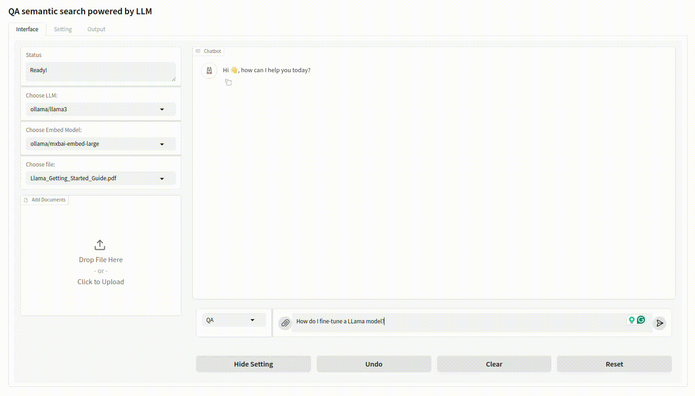

# QA Semantic Document Search powered by LLM

Unleash potential utilities of **L**arge **L**anguage **M**odels or **LLMs** (**ChatGPT**, **Google Gemini**, **Mistral**, etc.) with Llama Index.



Language models have the capacity to generate content based on similar source, but suffers from **halluciation**, which means that they can generate **false** content in the QA task, so relying solely on their answer can put users at high stake while seeking for accurate information.

Another use of LLMs is to retrieve similar text based on not only their *keywords* but their *meaning*, e.g. *word/sentence embedding* (**TL;DR** this is a Youtube video [(link)](https://youtu.be/5MaWmXwxFNQ) that explains the technique). This project aims to employ that technique to leverage LLMs in order to extract, resume, search information in various document datasources (PDFs, structured document folder, web, etc.).

We use [**llama-index**](https://docs.llamaindex.ai/en/stable/) as the main framework for Retrieval-Augmented Generation or **RAG** ([short video](https://youtu.be/T-D1OfcDW1M) for RAG explanation). This is an alternative to [**langchain**](https://www.langchain.com/).

# Getting started

## Install python virtual environment via Conda

Requirement:

- OS: Linux, Ubuntu (*Windows not tested yet, but possible*)

- *[Required for local LLM deployment]* Modern GPU Nvidia with >=8Gb (recommended). It is possible to run **Ollama** on other GPUs such as AMD, ARC Intel, or Apple M1. For more details, please consult information at [Ollama Git repository](https://github.com/ollama/ollama/blob/main/docs/gpu.md)

- [Miniconda](https://docs.anaconda.com/miniconda/miniconda-install/) or [Conda](https://www.anaconda.com/download/success)

- [Docker](https://docs.docker.com/) (for local Ollama deployment)

To install conda environment, please run the script ``./setup.sh``.
<details>
<summary>Note</summary>

The script will create a virtual environment located at ``.venv/llama_index_app/`` from the root of your project by default. You change change to your prefered location by adding your conda env repo, as the following example ``./setup.sh <your/conda/env/location>``
</details>

The detail of required python packages can be de seen in ``conda.yaml`` and ``lock.conda.yaml`` for all installed packages.

## Local deployment with Ollama

### Installation

The installation/ update command is 
```curl -fsSL https://ollama.com/install.sh | sh```

Pull/download models (LLMs) from [Ollama library](https://ollama.com/library). 

*(Note: we use 4-bit quantized models of inference efficiency*)

```bash
for MODEL in llama3 gemma2 gemma2:27b # 4-bit quantized models
do
    ollama pull $MODEL
done
```
*This project uses 2 main models: [Llama3](https://ai.meta.com/blog/meta-llama-3/) (by Meta AI) and [Gemma2](https://blog.google/technology/developers/google-gemma-2/) (by Google)*

<details>
<summary>Here are some example models that can be downloaded</summary>

| Model              | Parameters | Size  | Download                       |
| ------------------ | ---------- | ----- | ------------------------------ |
| Llama 3            | 8B         | 4.7GB | `ollama run llama3`            |
| Llama 3            | 70B        | 40GB  | `ollama run llama3:70b`        |
| Phi 3 Mini         | 3.8B       | 2.3GB | `ollama run phi3`              |
| Phi 3 Medium       | 14B        | 7.9GB | `ollama run phi3:medium`       |
| Gemma 2            | 9B         | 5.5GB | `ollama run gemma2`            |
| Gemma 2            | 27B        | 16GB  | `ollama run gemma2:27b`        |
| Mistral            | 7B         | 4.1GB | `ollama run mistral`           |
| Moondream 2        | 1.4B       | 829MB | `ollama run moondream`         |
| Neural Chat        | 7B         | 4.1GB | `ollama run neural-chat`       |
| Starling           | 7B         | 4.1GB | `ollama run starling-lm`       |
| Code Llama         | 7B         | 3.8GB | `ollama run codellama`         |
| Llama 2 Uncensored | 7B         | 3.8GB | `ollama run llama2-uncensored` |
</details>

For text embeddings, we use both Ollama and HuggingFace models
```bash
# For Ollama
for MODEL in mxbai-embed-large nomic-embed-text all-minilm snowflake-arctic-embed
do
    ollama pull $MODEL
done

# For HuggingFace model, the download is automatic
```

### Launch Ollama server

Run LLM model Docker server via the script ``./run_ollama.sh``. This conmand will launch a Docker container. *Ollama service is available at http://127.0.0.1:11434*

## [Optional] Advanced configuration

Users can control several useful parameters, but not all. We can re-configure the app via a YAML file. Following is an example of YAML configuration

<details>

<summary>Example of YAML file</summary>

```YAML
index_store: ./data/doc_search/index_store
file_storage: ./data/doc_search/docs
llm:
  model: llama3
  request_timeout: 120.0
embed_model:
  type: ollama
  name: mxbai-embed-large
  max_seq_length: 8192
  request_timeout: 120.0
  query_instruction: ""
query_engine:
  type: QA
  similarity_top_k: 12
  hierarchical: false
parser_config:
  name: simple_parser
  loader_name: single_file
  loader_config:
    file_extractor: [".md"]
    recursive: true
  index_store_name: vector_store_index
  result_type: markdown
  parsing_instruction: ""
  node_parser_name: markdown_node_parser
  llm:
    model: gemma2
    request_timeout: 120.0
  num_workers: 8
```
You can access to Setting **Tab** to change the system config interatively. Click "Get Current System Config", change config in the text box, then click on "Apply config"


</details>

## Launch Gradio app

Run the following command

```bash
# Conda venv location by default (.venv/llama_index_app/)
.venv/llama_index_app/bin/python gradio_app.py \
    --host 127.0.0.1
    # --config config/dev.yaml \ # For custom config
    # --share \ # To share at a public Gradio link
    # --debug \ # Enable debug mode
    # --show_api \ # Show API

```

The gradio app is accessible at https://127.0.0.1:7860 or https://localhost:7860

# Evaluation

- [ ] Implement an evaluation protocol based on paper:

  * Hallucination-Free? Assessing the Reliability of Leading AI Legal Research Tools - (Stanford University & Yale University) [[pdf]](https://dho.stanford.edu/wp-content/uploads/Legal_RAG_Hallucinations.pdf)

# Acknowledgement

This project is inspired by the work https://github.com/datvodinh/rag-chatbot/. I am grateful for your awesome project!
